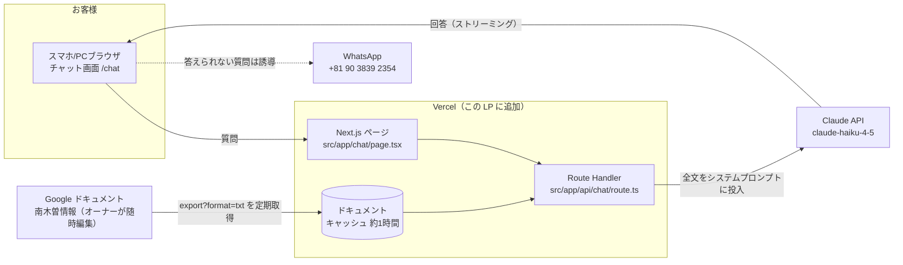

# 柏屋ゲスト向けチャットボット アーキテクチャ設計書

作成日: 2026-07-15
ステータス: 提案（実装前のドラフト）

## 1. 目的とスコープ

柏屋（南木曽）の以下3種類のお客様からの質問に、Googleドキュメント
（南木曽情報ドキュメント）を**最優先の情報源**として回答するチャットボットを作る。

| フェーズ | お客様の状態 | 質問の例 |
|---|---|---|
| 検討中 | 予約前 | 水回りは共用？ 夕食は1人前で頼める？ |
| 予約済み | 到着前 | 送迎はある？ 荷物だけ先に置ける? |
| 宿泊中 | 滞在中〜翌日 | チェックアウト方法、夕食のおすすめ、E-bike、ハイキングルート |

このフェーズ分けはドキュメントの構成（【事前系】【直前系】【当日系】【翌日系】）と
そのまま対応しているため、ボットの案内フローにも活用する。

## 2. 設計上の重要な前提

1. **情報源は小さい**。現在のドキュメントは数千文字程度で、今後増えても
   LLMのコンテキストに丸ごと入るサイズ。→ **ベクトルDB・RAG検索は不要**。
   ドキュメント全文をシステムプロンプトに入れる「全文投入方式」が
   最もシンプルで、回答の抜け漏れも起きない。
2. **ドキュメントはオーナーが随時更新する**。Google ドキュメントを
   そのまま「管理画面」として使い続けられる設計にする
   （コードを触らずにFAQを更新できることが最重要）。
3. **既存インフラを流用する**。この LP（Next.js 15 / Vercel）に
   チャットページと API を追加するだけで、新しいサーバーは立てない。
4. **多言語対応**。海外ゲストが多い（Booking.com、ビーガン/GF対応、WhatsApp 連絡）
   ため、日本語ドキュメントを元に英語等でも回答できる必要がある。
   → LLM がその場で翻訳して回答するので、ドキュメントは日本語のままでよい。

## 3. 全体アーキテクチャ



### コンポーネント

| # | コンポーネント | 実装 | 役割 |
|---|---|---|---|
| 1 | チャットUI | `src/app/chat/page.tsx`（クライアントコンポーネント） | メッセージ表示、フェーズ選択ボタン、よくある質問のクイックボタン、多言語切替 |
| 2 | チャットAPI | `src/app/api/chat/route.ts` | 会話履歴+質問を受け、システムプロンプトを組み立てて Claude API を呼び、ストリーミングで返す |
| 3 | ドキュメント取得 | `src/lib/knowledge.ts` | Google Docs の `export?format=txt` エンドポイントを fetch し、Next.js のキャッシュ（`revalidate: 3600`）で保持 |
| 4 | システムプロンプト | `src/lib/prompt.ts` | ボットの人格・制約・エスカレーション規則 + ドキュメント全文 |

## 4. 知識ソースの取り込み方式

**推奨: Google Docs のテキストエクスポートを実行時に取得（方式A）**

```
GET https://docs.google.com/document/d/1Ov1jL1LlsIyxElqkaZFjGjz5tXnu6hPYTlqj0enU1PA/export?format=txt
```

- ドキュメントを「リンクを知っている全員が閲覧可」に設定すれば API キー不要。
- Next.js の `fetch(url, { next: { revalidate: 3600 } })` で約1時間キャッシュ。
  オーナーがドキュメントを編集すると**最大1時間で自動反映**。コード変更・再デプロイ不要。
- 取得失敗時はリポジトリ内に置いたスナップショット（`src/data/knowledge-fallback.txt`）に
  フォールバックし、ボットが完全に沈黙する事態を防ぐ。

検討した代替案:

| 方式 | 内容 | 却下理由 |
|---|---|---|
| B: リポジトリに全文コピー | Markdown をリポジトリ管理 | オーナーが編集のたびに git 操作が必要になる |
| C: Google Drive API + サービスアカウント | 非公開のまま取得 | 鍵管理の手間が増える。FAQ に機密情報はないため過剰 |
| D: RAG（ベクトルDB） | 埋め込み検索 | 情報源が小さくコンテキストに全文が入るため不要。将来ドキュメントが数十万字級になったら再検討 |

## 5. システムプロンプト設計（要点)

```
あなたは長野県南木曽町のゲストハウス「柏屋」の案内係です。

# 情報源のルール（最重要）
- 以下の「柏屋・南木曽情報」を最優先の情報源とし、回答は原則としてここに
  書かれている内容に基づくこと。
- 情報源に答えがない質問には推測で答えず、正直に「わからない」と伝えた上で、
  マネージャーの WhatsApp (+81 90 3839 2354) への連絡を案内すること。
- 料金・時間・定休日などの数字は情報源の記載を一字一句正確に使うこと。

# 応対のルール
- お客様の言語（日本語/英語など）に合わせて回答する。
- URL（Google マップのルート、デリバリーメニュー、E-bike 予約サイト等）は
  情報源にあるものをそのまま提示する。
- 予約の確定・変更・キャンセルなどの「手続き」はボットでは行わない。
  Booking.com のメッセージまたは WhatsApp に誘導する。

# 柏屋・南木曽情報（ここに export した全文を挿入）
...
```

## 6. モデル選定とコスト

| 項目 | 推奨 | 理由 |
|---|---|---|
| モデル | `claude-haiku-4-5` | FAQ 応答には十分な品質で最安・最速。回答品質に不満が出たら `claude-sonnet-5` に1行変更で切替 |
| 1会話あたり | 入力 ~6k トークン（ドキュメント全文含む）× 数ターン | プロンプトキャッシュを使えば2ターン目以降の入力コストは約1/10 |
| 月額目安 | 1日30会話程度なら**数百円〜千円台** | 小規模宿の問い合わせ量なら誤差レベル |

API キーは Vercel の環境変数 `ANTHROPIC_API_KEY` に保存（クライアントには一切出さない）。

## 7. UI/導線

- **URL**: `https://kiso-ebike-lp.vercel.app/chat`（既存 LP に同居。将来独立ドメインも可）
- **導線**:
  - 検討中: LP・Booking.com 掲載ページからリンク
  - 予約済み: Booking.com のダイレクトメッセージに URL を記載（食事予約フォーム案内と同じ流れ）
  - 宿泊中: 館内掲示の QR コード（エントランス・各部屋）
- **初期画面**: 「ご予約前 / ご到着前 / ご滞在中」の3ボタン + よくある質問チップ
  （チェックアウトは？ / 夕食のおすすめ / E-bike の使い方 / ハイキングルート）。
  ボタンを押すとそのフェーズを文脈としてボットに渡す。
- **各回答の末尾**に「解決しない場合は WhatsApp へ」リンクを常設。

## 8. 安全対策・運用

1. **レート制限**: IP ごとに 1分あたり N リクエスト（Vercel 上で簡易実装、
   本格化するなら Upstash Redis）。API コストの暴走防止。
2. **入力制限**: 1メッセージの最大文字数、1会話の最大ターン数を制限。
3. **トピックガード**: システムプロンプトで「柏屋・南木曽の案内以外の依頼
  （コード生成、一般雑談など）は丁重に断る」と明記。
4. **ログ**: 最初は Vercel のログで質問内容を確認 → 「答えられなかった質問」を
   オーナーが Google ドキュメントに追記する運用ループを回す。
   これがそのままドキュメントの改善サイクルになる。
5. **個人情報**: 予約番号・氏名等の入力を求めない。手続きは必ず人間（WhatsApp）へ。

## 9. 実装ステップ（MVP → 拡張）

### フェーズ1: MVP（このリポジトリ内で完結、実装 1〜2日規模）
1. `src/lib/knowledge.ts` — ドキュメント取得 + キャッシュ + フォールバック
2. `src/app/api/chat/route.ts` — Claude API 呼び出し（ストリーミング、プロンプトキャッシュ有効）
3. `src/app/chat/page.tsx` — チャット UI（フェーズボタン、クイック質問、日英対応）
4. Vercel に `ANTHROPIC_API_KEY` を設定してデプロイ

### フェーズ2: 運用改善
- 会話ログの保存（Vercel KV など）と「未回答質問レポート」
- レート制限の本格化
- 館内 QR コード用の言語別エントリ URL（`/chat?lang=en&phase=staying`）

### フェーズ3: 将来の拡張（必要になったら）
- ドキュメントが複数・大規模化したら RAG（検索）方式へ移行
- WhatsApp / LINE ボット化（Business API 連携）
- 食事予約フォームや E-bike 予約への構造化連携（ボットが空き確認まで行う等）

## 10. リポジトリ構成（フェーズ1完了時の想定）

```
src/
  app/
    page.tsx            # 既存: E-bike LP
    reserve/page.tsx    # 既存: 予約ページ
    chat/page.tsx       # 追加: チャット UI
    api/chat/route.ts   # 追加: チャット API
  lib/
    knowledge.ts        # 追加: Google Doc 取得・キャッシュ
    prompt.ts           # 追加: システムプロンプト組み立て
  data/
    knowledge-fallback.txt  # 追加: 取得失敗時のスナップショット
```
